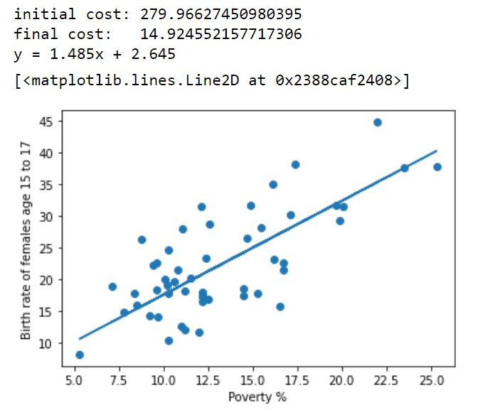
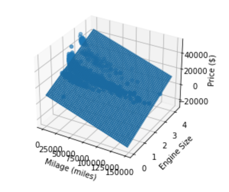

# Stanford ML Implementations and Notes

[Stanford ML Course by Andrew Ng](https://www.coursera.org/learn/machine-learning)

Jupyter Notebook by Jason Zhang

## Week 1
### Implementations
[Linear Regression Gradient Descent](https://github.com/Zjjc123/stanford-ml-course/blob/main/week-1/2.Gradient%20Descent.ipynb)

[Multivariable Linear Regression Gradient Descent](https://github.com/Zjjc123/stanford-ml-course/blob/main/week-2/1.Multivariate%20Linear%20Regression.ipynb)

[Multivariable Linear Regression Analytically](https://github.com/Zjjc123/stanford-ml-course/blob/main/week-2/3.Normal%20Equation.ipynb)

